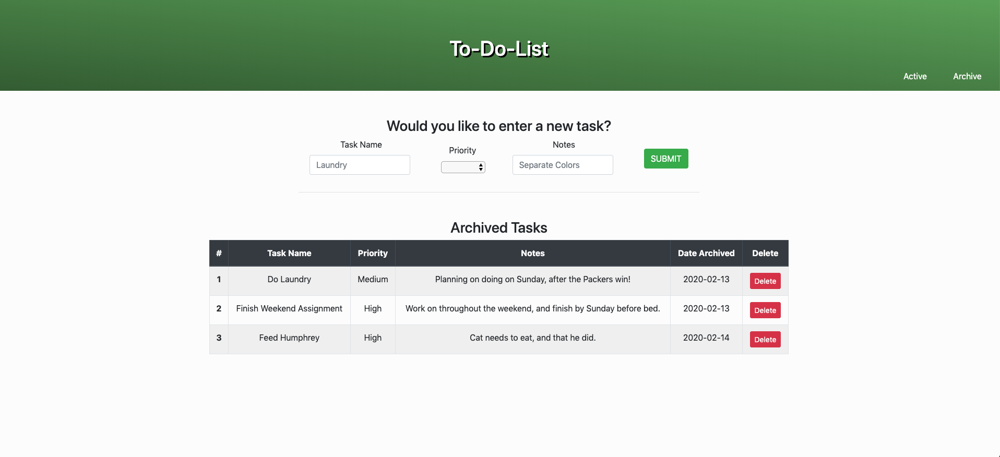

# To-Do-List
## Description
_Duration: Weekend Sprint_

People become much more efficient when they are able to keep track of tasks that they need to complete. To-Do-List app allows a user to add tasks, and archive them in an organized fashion.

This project uses jQuery and AJAX requests, alongside node and a local postgresQL database to create a to-do-list application. The user can use the interface to input a task name, priority level, and notes which are sent through node to the database through an AJAX POST request, where the task is stored.

The tasks table is then retrieved through an AJAX GET request and shown on a table on the DOM. The user can delete each task with a the DELETE button through an AJAX DELETE request. This task is then removed from the database and the updated table is shown on the DOM.

Users can update the Priority and Status of each task by choosing the correct value in the dropdown of the chosen item on the table and clicking its Update button. 

You can find the deployed version of this app [here](https://my-sql-to-do-app.herokuapp.com/)

## Schreenshots



### Prerequisites

Link to software that is required to install the app (e.g. node).

- [Node.js](https://nodejs.org/en/)
- [PostgreSQL](https://www.postgresql.org/download/)
- Suggested to install [Postico](https://eggerapps.at/postico/) or a PostgreSQL GUI of your choosing.

## Installation

1. Get to main project directory in command line, and type in `npm install` to install required dependencies.
2. Create "weekend-to-do-app" database in host "localhost".
3. Run commands from database.sql file in GUI to create table, in `weekend-to-do-app` database.
4. Run ```npm start``` in the command line in the project repository.
5. Type in localhost:5000 in your url bar in your browser.


## Usage

1. Enter Task Name, Priority, and Notes in the form field and press Submit.
2. If you would like to change Priority of a task, change the dropdown of the ```Priority``` and press ```Update```.
3. If you would like to complete a task, change the dropdown of the Status to ```Complete``` and press ```Update```.
4. Press ```delete``` button if you want to delete a task from the table. 
5. If you want to archive a task, press the ```Archive``` button.
6. You can switch between the Archived and Active views by clicking on your choice in the bottom right area of the header.


## Built With
- _node.js_
- _Express.js_
- _jQuery_ 
- _postgreSQL_

## Support

If you have any questions, feel free to email me at bakerpj1992@gmail.com

---

## Where I want to go from here

1. [x] Continue Styling page, get header to center above table
2. [x] Add more styling to .completedTasks
3. [x] Add verification to the input boxes, and require choice of priority dropdown to prevent faulty input.
4. Sort by each column in table by clicking on respective header.
5. [x]  Archive completed tasks to seperate table upon archive button press
